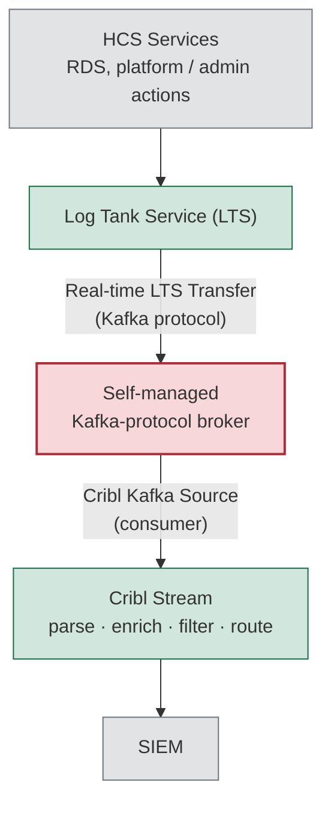

# LTS-to-Cribl-to-SIEM Log Pipeline: Real-Time Security Log Delivery Design on Huawei Cloud Stack

> **Note on redaction:** The employer name and the name of the Huawei Solution Architect who verified the platform constraint on a design call have been generalised throughout this document (referenced here as "the organisation" and "a Huawei Solution Architect"). No other identifying detail is included.
>
> **Note on project status:** This repository documents an accepted architecture decision, not a deployed system. The design is recorded and superseded a prior draft through the architectural decision record (ADR) process described below, but the broker has not yet been provisioned and several implementation choices remain open, listed explicitly in this document rather than presented as settled. This is a design and decision-making case study: a README describing the reasoning, the platform constraints that were verified rather than assumed, and the implementation plan that follows from them.

## Table of Contents

- [Overview](#overview)
- [Real-World Business Value](#real-world-business-value)
- [Skills Demonstrated](#skills-demonstrated)
- [Project Folder Structure](#project-folder-structure)
- [Tasks and Implementation Steps](#tasks-and-implementation-steps)
- [Core Implementation Breakdown](#core-implementation-breakdown)
- [IAM Role and Permissions](#iam-role-and-permissions)
- [Project Features (Detailed Breakdown)](#project-features-detailed-breakdown)
- [Design Decisions and Highlights](#design-decisions-and-highlights)
- [Local Testing and Validation](#local-testing-and-validation)
- [Conclusion](#conclusion)

## Overview

This repository documents the design of a real-time pipeline delivering Huawei Cloud Stack (HCS) Log Tank Service (LTS) log data — RDS audit logs, RDS error logs, and platform and administrative logs — into a Cribl Stream instance and onward to a SIEM, for an organisation running HCS as a private-cloud platform in a regulated banking environment.

The vendor's original proposal was `LTS → Kafka → Cribl Stream → SIEM`. The organisation's security team flagged the standalone Kafka layer as unacceptable operational and security overhead, and asked for a design with no additional intermediary — ideally LTS delivering straight into Cribl. That request was tested against two platform facts, both confirmed directly against the platform's own API and Cribl's own connector behaviour rather than assumed from vendor conversation:

1. **LTS can only export logs two ways.** Its `LTS Transfer` feature supports exactly two destination families: a scheduled transfer to object storage, or a real-time transfer to a Kafka-protocol endpoint. There is no third, protocol-agnostic direct-push mechanism, verified against the platform's own `CreateTransfer` API rather than taken from vendor correspondence alone.
2. **Cribl Stream cannot itself be that Kafka-protocol endpoint.** Cribl's Kafka Source is a pull-based consumer client: it connects out to an existing broker's bootstrap servers rather than opening a Kafka-protocol listener for something else to connect into. This rules out a zero-intermediary design regardless of Cribl configuration.

**Scope boundaries.** In scope: RDS audit logs, RDS error logs, and platform and administrative (privileged-access) logs — the streams that map to the security team's stated concern about privileged user activity. Out of scope: RDS slow query logs and ECS operational logs, which are performance signals rather than security signals and remain in the existing Prometheus and Grafana observability stack documented in the companion repositories, rather than being duplicated into the SIEM pipeline.

## Real-World Business Value

- **A vendor's simplified pitch was tested before being accepted.** "Direct" delivery from LTS to Cribl was verified as architecturally impossible on this platform, against the real API and the real connector behaviour, rather than discovered as a gap after implementation had begun.
- **The security team's objection was not overridden, it was surfaced as an explicit trade-off.** Accepting a self-managed broker reopens exactly the operational overhead the security team originally objected to. That tension is presented as a decision for the team to make with full information, rather than resolved unilaterally in the design document.
- **The comparison against every major public cloud shows this is a platform-maturity gap, not a design failure.** AWS, Azure and Google Cloud all solve the same problem with a fully managed streaming conduit between their log service and Cribl. Huawei's equivalent exists on its public cloud but not on the private-cloud deployment this organisation runs, which reframes an awkward internal conversation into a documented, evidenced platform limitation.
- **Real-time delivery is preserved where it matters.** Privileged-access and audit log alerting cannot tolerate a polling-interval delay, and the design is built around that stated hard requirement rather than defaulting to the operationally simpler polling alternative.
- **A lower-effort fallback is preserved, not discarded.** The superseded object-storage polling design remains recorded and available if the real-time requirement is ever relaxed, rather than being deleted once a different path was chosen.
- **Scope is deliberately limited to security-relevant signal.** Operational and performance logs stay in the existing observability stack rather than being duplicated into the SIEM pipeline, controlling both ingestion cost and alert fatigue at the SIEM layer.

## Skills Demonstrated

- **Vendor-claim verification.** Testing a proposed architecture against the platform's own API behaviour and the destination tool's own connector model, rather than accepting a vendor's description of what is possible.
- **Comparative cloud architecture analysis.** Mapping the same logging-to-SIEM problem across four cloud platforms to establish whether a constraint is a genuine platform limitation or a configuration gap.
- **Security-driven design reversal.** Taking a security objection seriously enough to attempt to design around it, and being honest in the final document when that objection could not be fully satisfied.
- **Architectural decision records with supersession.** Recording an initial design, and formally superseding it with a second ADR when new platform facts changed the answer, rather than quietly rewriting history.
- **Transparent trade-off documentation.** Presenting a decision's downside explicitly, in the same document that recommends it, rather than only in retrospect.
- **Streaming security architecture.** Designing topic-per-stream isolation, TLS and SASL/SCRAM or mutual TLS authentication, least-privilege broker credentials, and persistent-queue-based resilience against downstream outage.
- **Log pipeline design.** Specifying parsing, enrichment, security-relevant event tagging, and noise filtering stages for a Cribl processing pipeline ahead of SIEM ingestion.

## Project Folder Structure

```
README.md                                        # This document
CONTEXT.md                                        # Glossary of platform and pipeline terms
IMPLEMENTATION-PLAN.md                            # The original object-storage-based draft, superseded
adr/
├── obs-relay-instead-of-kafka-broker.md     # Superseded: cyclical object-storage relay design
└── self-managed-kafka-for-hcs-realtime.md   # Current: self-managed Kafka-protocol broker design
```

This repository is a documentation-only design case study. There is no deployment code to browse, since the broker described here has not yet been provisioned; the value of this piece is the verification work and the decision record, not a codebase.

## Tasks and Implementation Steps

1. **Verified the two platform facts that ruled out a zero-intermediary design**, against the platform's own `CreateTransfer` API and Cribl's documented Kafka Source connector behaviour, rather than relying on the vendor's initial proposal.
2. **Mapped the same problem across AWS, Azure, Google Cloud and Huawei's public cloud**, establishing that every major provider solves it with a managed streaming conduit, and that Huawei's private-cloud deployment is the outlier in not offering one.
3. **Recorded the initial object-storage-relay design as an ADR**, then formally superseded it once the real-time requirement was confirmed as non-negotiable, preserving the original reasoning rather than deleting it.
4. **Selected a self-managed Kafka-protocol broker as the only remaining path to real-time delivery**, and evaluated a lighter Kafka-wire-compatible alternative to reduce, without eliminating, the operational burden that choice reopens.
5. **Designed topic-per-log-stream isolation** so that LTS, the broker, and Cribl each have a narrow, auditable path rather than a shared general-purpose channel.
6. **Specified the Cribl-side configuration**: one Kafka Source per topic, a unique consumer group ID per Source to avoid unintended rebalancing, and a shared or per-Source pipeline for parsing, enrichment, security-event tagging, and noise filtering.
7. **Specified resilience at the broker rather than at Cribl alone**: topic retention sized to cover expected downstream outage windows, since a genuine event stream depends on broker-side retention rather than an object-storage lifecycle rule.
8. **Documented every open decision explicitly** — the SIEM product, the Kafka-versus-RedPanda choice, and operational ownership — rather than presenting the design as more finished than it is.

## Core Implementation Breakdown

### Why no major cloud delivers logs straight into Cribl either

No public cloud provider bridges its log service directly into Cribl without an intermediary. Each uses its own managed streaming or eventing service as the conduit:

| Provider | Log service | Conduit | Cribl side |
|---|---|---|---|
| AWS | CloudWatch Logs | Kinesis Data Firehose | Native Firehose HTTP Endpoint Source |
| Azure | Azure Monitor | Event Hubs | Native Event Hub Source |
| Google Cloud | Cloud Logging | Pub/Sub | Native Pub/Sub Source |
| Huawei public cloud | LTS | DMS Managed Kafka | Kafka Source |
| Huawei Cloud Stack (private cloud) | LTS | No managed option | Kafka Source |

It reads as "direct" on the public-cloud rows only because the conduit is fully managed by the provider and Cribl ships a purpose-built connector for it. Huawei's public-cloud equivalent, DMS Managed Kafka, would fill the same role on this platform, except that a Huawei Solution Architect confirmed directly on a design call that it is a public-cloud-only service: this private-cloud deployment has no managed Kafka broker component alongside its log store, and no setting or add-on provisions one. That is a deployment-model limitation, not a negotiable configuration choice.

### The accepted architecture



The broker highlighted in red is the one component in this chain the organisation operates itself; every other box is a managed platform or vendor service. That single box is also the entire subject of the trade-off discussed below.

### Registering the real-time transfer

Once the broker is provisioned and registered, a real-time transfer is created per in-scope log stream through the LTS `CreateTransfer` API:

```json
POST /v2/{project_id}/transfers
{
  "log_group_id": "<lts-log-group-id>",
  "log_streams": [ { "log_stream_id": "<rds-audit-stream-id>" } ],
  "log_transfer_info": {
    "log_transfer_type": "DMS",
    "log_transfer_mode": "realTime",
    "log_storage_format": "JSON",
    "log_transfer_status": "ENABLE",
    "log_transfer_detail": {
      "kafka_id": "<registered-broker-instance-id>",
      "kafka_topic": "lts-rds-audit"
    }
  }
}
```

One topic per in-scope log stream keeps the isolation the security controls below depend on: `lts-rds-audit`, `lts-rds-error`, `lts-platform-admin`.

### Cribl-side configuration

Per topic, a Kafka Source is configured in the Cribl Worker Group with TLS enabled, a SASL mechanism matching the broker's configuration, and a unique consumer group ID per Source, specifically to avoid unintended consumer-group rebalancing across unrelated Sources. A Pipeline attached to each Source, or a shared one filtered on the topic, performs JSON parsing of the LTS export payload, enrichment with hostname, cloud resource ID, environment and database name, tagging of security-relevant events (privileged activity, failed logins, DDL changes, user creation, permission escalation), and filtering of health checks and debug-level noise before anything reaches the SIEM.

### Resilience

Cribl's Persistent Queue provides disk-based buffering against a temporary SIEM outage, but because this is a genuine event stream rather than a periodic poll, the meaningful protection against data loss during a Cribl-side interruption is broker-side topic retention, sized to cover the expected downtime window, not an object-storage lifecycle rule. Because the broker is self-operated, standard Kafka high-availability practice applies: a minimum of three broker nodes for quorum and replication if uptime requirements justify the additional operational cost, rather than a single node.

## IAM Role and Permissions

- **Network isolation by design.** Only three paths are permitted: LTS to the broker, the broker to Cribl, and Cribl to the SIEM. No other network path to the broker exists.
- **Encryption on every hop.** TLS 1.2 or later is required on LTS-to-broker, broker-to-Cribl, and Cribl-to-SIEM traffic, with no exception.
- **No anonymous or plaintext access.** The broker requires SASL/SCRAM or mutual TLS authentication on every listener; a plaintext or anonymous listener is explicitly excluded from the minimum configuration.
- **Least-privilege, per-topic broker credentials.** The credentials LTS uses to produce, and the credentials Cribl uses to consume, are scoped to their respective topics only, never to cluster-wide administrative access.
- **Security posture is a shared responsibility, stated as such.** Neither the self-managed broker path nor the object-storage fallback is inherently more secure; the actual security posture depends on how TLS, authentication, and network isolation are configured, which is the organisation's responsibility under either design.

## Project Features (Detailed Breakdown)

### Platform-constraint verification before design

**Purpose.** Avoid designing around a vendor's simplified description of what the platform can do.
**Implementation summary.** Both blocking facts — LTS's two-destination-family limit and Cribl's pull-only Kafka Source — were confirmed against the platform's actual `CreateTransfer` API and Cribl's documented connector behaviour, and directly with Huawei's Solution Architecture team on a design call, rather than accepted from an initial proposal.
**Operational considerations.** This verification is what allows the final design document to state platform limitations as confirmed facts rather than hedged assumptions, which matters when the resulting recommendation reopens a concern the security team had already raised once.

### Self-managed Kafka-protocol broker as the real-time bridge

**Purpose.** Provide the only viable path to real-time delivery once a managed conduit was confirmed unavailable on this platform.
**Implementation summary.** A Kafka-wire-compatible broker, evaluated as either full Apache Kafka or a lighter alternative such as RedPanda, sits between LTS's real-time transfer and Cribl's Kafka Source, satisfying both sides' protocol expectations without requiring either to change.
**Operational considerations.** This choice knowingly reopens the operational overhead the security team originally objected to; that tension is not hidden but stated as an explicit, open trade-off for the team to weigh.

### Topic-per-stream isolation

**Purpose.** Keep each in-scope log stream on its own auditable path rather than a shared general-purpose channel.
**Implementation summary.** RDS audit, RDS error, and platform and administrative logs each get a dedicated topic and a dedicated Cribl Kafka Source, with per-topic credential scoping.
**Operational considerations.** Isolation at the topic level is also what makes the least-privilege credential model enforceable; a shared topic would force shared, broader credentials.

### Cribl processing pipeline

**Purpose.** Turn raw LTS export payloads into SIEM-ready, security-relevant events.
**Implementation summary.** Parsing, field enrichment, security-relevant event tagging, and noise filtering are applied before the SIEM destination, rather than forwarding raw log volume.
**Operational considerations.** Filtering health checks and debug-level events before the SIEM boundary controls both ingestion cost and downstream alert fatigue, which matters directly for a security team that will be the one triaging SIEM alerts.

### Resilience through broker retention and persistent queueing

**Purpose.** Prevent a temporary SIEM outage from becoming a log-loss event.
**Implementation summary.** Cribl's Persistent Queue buffers against a brief SIEM interruption, while broker-side topic retention, sized to the expected downtime window, is the actual protection against loss during a Cribl-side interruption.
**Operational considerations.** This distinction matters because the two failure modes are different: a SIEM outage and a Cribl outage require the buffer to exist at different points in the pipeline, and conflating them would leave one of the two scenarios unprotected.

### Transparent trade-off documentation

**Purpose.** Give the team an honest basis for a decision the design document itself cannot make unilaterally.
**Implementation summary.** A single comparison table states plainly that the recommended real-time design fails the "no additional operational overhead" requirement, while the superseded polling fallback fails the "must be real-time" requirement, with neither hidden.
**Operational considerations.** This is presented as a live decision point rather than a foregone conclusion, with the fallback design preserved and referenceable rather than deleted once the real-time path was chosen.

## Design Decisions and Highlights

| Decision | Alternatives Considered | Rationale |
|---|---|---|
| Self-managed Kafka-protocol broker between LTS and Cribl | A zero-intermediary "direct" design as originally requested | Confirmed architecturally impossible on this platform: LTS has no protocol-agnostic push mechanism, and Cribl's Kafka Source only pulls from an existing broker |
| Real-time transfer over cyclical object-storage transfer | The lower-effort object-storage polling design (the superseded relay ADR) | Real-time delivery was stated as a hard requirement for privileged-access and audit log alerting, which cannot tolerate polling-interval latency |
| RedPanda evaluated alongside full Apache Kafka | Committing to Apache Kafka outright | A single-binary, Kafka-wire-compatible alternative with no ZooKeeper/KRaft cluster or JVM to operate reduces, without eliminating, the operational burden the design otherwise reopens |
| One topic per in-scope log stream | A single shared topic for all log types | Preserves per-stream isolation and makes least-privilege, per-topic credential scoping enforceable |
| Scope limited to RDS audit, RDS error, and platform/admin logs | Including operational and performance logs in the same pipeline | Operational and performance signals already have a home in the existing observability stack; duplicating them into the SIEM pipeline would only add ingestion cost and alert noise |
| The operational-overhead trade-off is stated explicitly rather than resolved silently | Presenting the self-managed broker design as a clean solution | Accepting a self-managed broker reopens exactly the concern the security team raised about the original vendor proposal; the honest response is to say so, not to obscure it |
| The superseded ADR is kept, not deleted | Rewriting the original design document once the real-time requirement changed the answer | Preserves the reasoning behind the original object-storage design so it remains available as a documented, lower-effort fallback if requirements ever change |

## Local Testing and Validation

There is no deployed code to test in this repository; validation here means confirming the platform constraints that the entire design rests on, rather than accepting them secondhand:

1. **LTS's export mechanism was checked against the real `CreateTransfer` API**, not inferred from vendor documentation alone, to confirm that only a scheduled object-storage transfer and a real-time Kafka-protocol transfer exist as destination families.
2. **Cribl's Kafka Source behaviour was checked against Cribl's own connector documentation**, confirming it operates strictly as a pull-based consumer against an existing broker's bootstrap servers, which rules out any configuration in which Cribl itself could act as the Kafka-protocol endpoint LTS transfers into.
3. **The absence of a managed Kafka option on this private-cloud deployment was confirmed directly by Huawei's Solution Architecture team on a design call**, rather than assumed from the existence of the equivalent public-cloud service, DMS Managed Kafka.

Each of these three checks removes one candidate architecture from consideration with evidence rather than assumption, which is what allows the final recommendation to state its constraints as confirmed rather than believed.

## Conclusion

The value in this design is not the pipeline itself, which is a fairly standard log-shipping architecture once the constraints are known — it is the refusal to accept a vendor's simplified pitch at face value. "LTS straight into Cribl" sounded achievable until it was checked against the actual API and the actual connector model, at which point it turned out to be architecturally impossible on this platform rather than merely undocumented. The harder and more honest part of the document is what follows that finding: the fix reopens the exact operational overhead the security team objected to in the first place, and rather than quietly presenting the new design as a clean win, that tension is stated plainly as an open trade-off for the team to weigh, with the lower-effort fallback preserved rather than discarded. The open items listed at the end — which SIEM product, which broker technology, who operates it — are left open because they genuinely are, which is a more useful document than one that manufactures false certainty to look finished.
